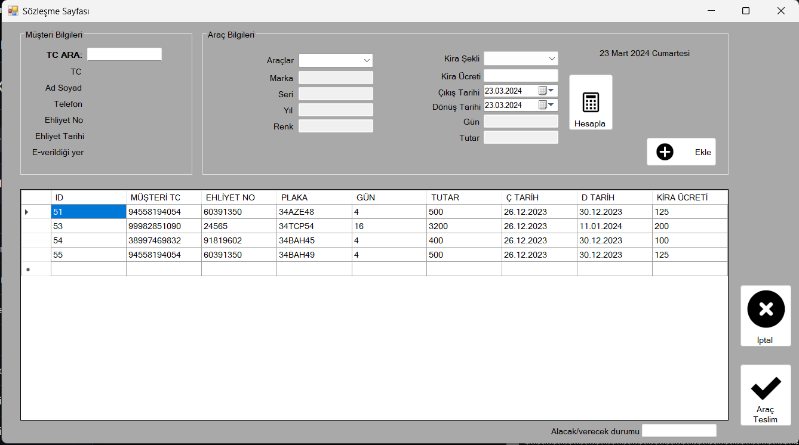

## C# Windows Forms ve PostgreSQL kullanarak geliştirdiğim Araç kiralama otomosyonu.

Program Dili: Türkçe

## Kullanım

Bu otomasyon sistemini kullanarak:

- Müşterileri kaydedebilir,
- Araçları ekleyebilir,
- Kiralama işlemlerini gerçekleştirebilir,
- Kiralık araçların durumlarını takip edebilir,
- vb.

## Ekran Görüntüleri
  

